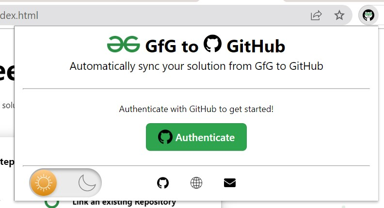
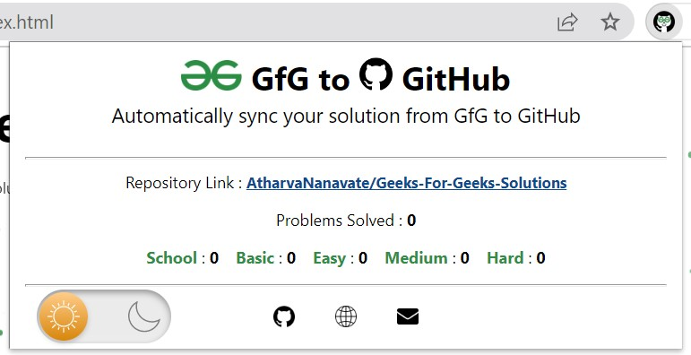
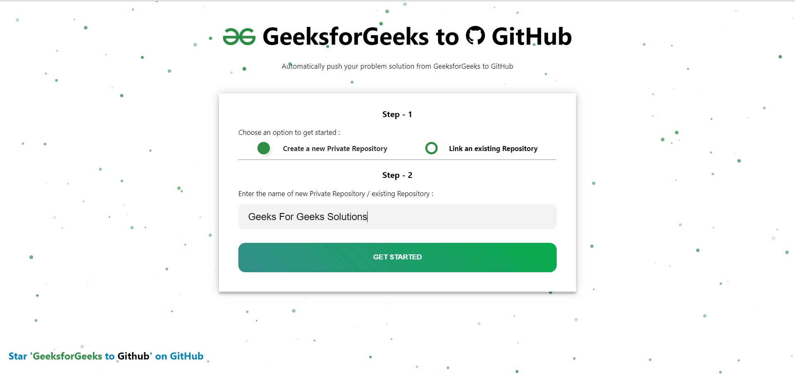
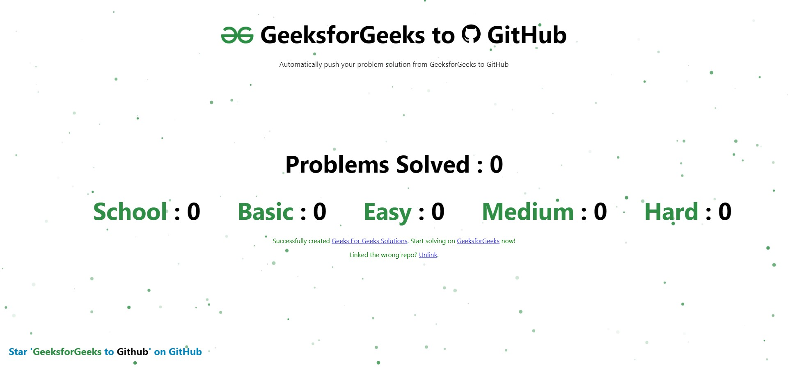

</a>

# 
GfG To GitHub

This is a Chrome Extension that automatically pushes your GeeksForGeeks problem's solution to a GitHub Repository of your choice within seconds on successful submission.

## 1. Why GfG to GitHub?

- In the modern day, GitHub is a developer's primary portfolio. Therefore, this extension aids in centralizing all of your GeeksForGeeks solutions in an organised manner. 

- Also, manually adding your GeeksForGeeks solutions to a GitHub repository is an extremely time-consuming and tedious procedure. Therefore, this extension automates the entire process without you needing to put-in any extra effort.

- Centralising your solutions means easy and fast access to all your solutions.

- Having all your solutions in one place helps you to keep track of your progress.

## 2. Features

- You can create a new repository / link an existing repository to this extension by simply entering the repository name during the onboarding process.

- The extension popup sports a dashboard that maintains difficulty-level-wise count of the problems you have solved on GeeksForGeeks.

- Each solution is pushed into a directory named as the difficulty level of that problem. So, the repository is extremely organised.

- A README.md file is created for each new problem solved. This README.md file contains the problem details as it appears on the GeeksForGeeks problem's page.

- This extension also supports multi-language submissions, which means that if you solve a problem in both Java and C++, a separate file will be created for both languages under the same directory.

- A solution file is committed to your GitHub repository only on successful submission on GeeksForGeeks.

- The extension popup also features a Dark Mode toggle, so you can choose a theme of your choice.

- The homepage features an interactive background that uses Particle.js.
## 3. Documentation

The following is a detailed documentation of the extension.

### Flow

#### i. Onboarding

- The user can download and install the extension from Chrome Web Store.

- Once the extension has been installed on the browser, the user has to open the extension popup by clicking on the 'Extensions' icon which is present at the top-right of the screen.

- The user will see a Green button which says 'Authenticate'. The user can then click on it. This button will redirect the user to the GitHub OAuth authentication page.

- Once the user successfully authenticates his/her GitHub account. He/she will be automatically redirected to the Extension homepage.

- Here, the user can choose to either create a new repository / link an existing repository to store the GeeksForGeeks solutions. The user has to select a radio box accordingly.

- Next, the user has to enter the repository name in the text field below. If the user chose to create a new repository, then they will have to enter the name of the repository that they want to create and it will be automatically created by the extension on clicking on 'Submit'.

- On the other hand, If the user chose to link an existing repository then they will have to enter the exact name to the repository that they want to link. The repository will be successfully linked if the name was correctly entered, or an error message will be displayed accordingly.

- Once the repository has been created / linked, the onboarding process is complete. This entire onboarding process takes less than a few minutes.

- If for some reason, the user is not able to complete the linking at this stage, they can open the popup window and click on the 'Link Repository' button to continue from here again.

#### ii. Pushing your solutions to the GitHub repository

- The user now has to visit 'practice.geeksforgeeks.org' and start solving.

- Now, everytime the user successfully submits a problem's solution and it is correct, i.e, the solution passes all the testcases and is marked as 'Successfully Solved' on GeeksForGeeks. The extension will automatically push the solution to the linked GitHub Repository.

- The solutions are well organised in the user's repository. Each problem is pushed to a directory which is named after the difficulty level of the problem.

- Along with the solution, a README.md file is created for every new problem solved. This file contains the problem title, problem description, the example testcases, constraints, company tags and topic tags exactly as they appear on the GeeksForGeeks' problem page.

- After each successful submission, the statistics on the user dashboard are updated, showing the difficulty level-wise number of problems solved.

#### iii. The Home Page

- The home page can be visited by clicking on the 'Globe' icon in the popup window.

- The user is taken through the onboarding process using this page itself.

- Once the onboarding process has been completed, the homepage displays the user's GeeksForGeeks statistics.

- The background of this page sports an interactive bubble themed canvas. This was built using the Particle.js library.

- The bottom-right corner of this page sports a link to this GitHub Repository.

#### iv. The Popup Window

- The user's first interaction with the extension happens through the popup window. This window has a header with the Extension name and the tagline. The header is common during all the phases of onboarding, and later.

- The Middle-section contains a green 'Authenticate' button when the extension has just been installed. This buttom redirects the user to GitHub OAuth page where the user gets authenticated.

- Once the user successfully completes GitHub authentication, the middle section will contain a green 'Link Repository' button. The user is redirected to the extension homepage upon clicking this where the user can link a repository to this extension.

- In the final phase, after the user has successfully linked a GitHub Repository to this extension, the Middle-Section will sport a dashboard with difficulty-level-wise statistics of the problems solved by the user.

- The bottom part of the popup window is divided into two parts, and is present during all the phases : 
  - The first part is a Dark Mode toggle. The user can choose a theme of their choice by using toggling between themes. 
  
  - The second part contains three icons. The first one is a hyperlink to this repository. The second one is a hyperlink to the homepage. The third one is a hyperlink to mail the developer.
## 3. Setup the extension locally for development

#### To setup the extension locally for development : 

- Simply download this GitHub Repository as a .zip file.

- Extract it on your device. 

- Now, go to [chrome's extension tab](chrome://extensions/), and turn on the 'Developer Mode' by switching the toggle on the top-right corner of the screen.

- Now, click on 'Load Unpacked' and browse to the extracted folder and open it.

You are ready to go!
## 4. Download the Extension

- The extension has been published on the Chrome Web Store and can be installed by visiting the URL given below :

    [GfG to GitHub](https://chrome.google.com/webstore/detail/gfg-to-github/gojabhkegjnlnklkkpkglaembhlknkgk)
## 5. Illustrations
- Popup Window

</a>

 

</a>

- Index Page

</a>

 

</a>

